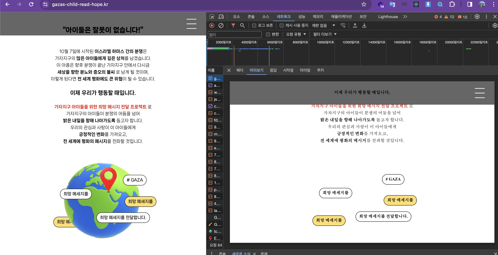

# CSR과 SSR(SSG약간)

> author: @rud1676

- [1.CSR]
  - [1.1-CSR의-개념]
  - [1.2-CSR이-필요했던이유]
  - [1.3-CSR로-사이트제작하기]
- [2.SSR]
  - [1.1-SSR의-개념]
  - [1.2-SSR이-왜다시떠오를까?]
  - [1.3-SSR,CSR을-구분하여-보여주기]
- [3.SSG]
- ***

## 웹사이트 랜더링의 의미

웹사이트 렌더링은 웹 페이지의 콘텐츠를 사용자의 브라우저에 표시하는 과정. 서버와 클라이언트의 상호작용 방식에 따라 여러 가지 방식으로 진행된다.

## CSR

### CSR의 개념

Client-Side Rendering, 의 약자로 CSR은 웹 페이지의 콘텐츠가 사용자(고객)의 브라우저, 즉 클라이언트 측에서 렌더링되는 방식.
이 방식에서는 고객의 브라우저가 서버로부터 최소한의 HTML 구조를 받은 후(1차 로딩), JavaScript를 사용하여 필요한 데이터를 요청하고, 이를 바탕으로 페이지를 동적으로 생성한다.

즉, 페이지의 실제 콘텐츠와 구조는 사용자의 브라우저에서 JavaScript에 의해 결정된다.
CSR의 핵심은 사용자의 상호작용에 따라 **필요한 부분만** 다시 렌더링하며, 이는 페이지 전환의 속도를 향상시키고 사용자 경험을 불편함 없이 향상시킬 수 있다.

### CSR이 도입된 이유

웹의 초기 시절, 대부분의 웹사이트는 Server-Side Rendering, 즉 SSR 방식을 사용했다. 이때, 서버는 사용자의 모든 요청에 대해 완전한 HTML 페이지를 던져줬다.

하지만 인터넷의 발전과 사용자의 기대치 증가로 인해, 웹 애플리케이션은 더욱 역동적이게 되었는데. 이에 따라 페이지 전체를 새로 불러오는 것은 엄청난 리소스를 낭비하게 되었다. 따라서 도입된 개념이 필요한 부분만을 업데이트하는 방식이고, 이를 가능하게 하는 기술이 바로 CSR이다.

CSR의 등장은 새로운 개념을 또한 등장시켰는데, 이는 Single Page Applications (SPA)의 등장으로 이어졌다. SPA에서는 웹 페이지가 한 번 로드된 후, 사용자의 상호작용에 따라 필요한 부분만을 JavaScript를 통해 업데이트한다.

즉, SPA는 사이트를 이용하는데 처음 로딩 때 완전히 받아와 - 마치 게임 클라이언트 처럼 - 사용자 반응에 따라 부분부분 화면만 바꿔주고 데이터를 불러오는 방식을 사용한다.

### CSR로 웹페이지를 제작하는 방법

CSR의 웹사이트를 만드려면 주요개념 몇가지를 알아야된다.

1. HTML과 CSS는 웹사이트의 기본 구조와 스타일을 정해야함.
2. JavaScript와 함께 클라이언트 측에서 동작하는 프레임워크 또는 라이브러리를 사용합니다. (feat. React, Vue.js, Angular)

이러한 도구들은 웹 애플리케이션의 상태 관리, 컴포넌트 기반 아키텍처, 그리고 반응형 UI를 가능하게 한다.

또한 CSR 웹사이트를 만드는 프레임워크에서 동작을 아래의 5개로 구분한다.

- 초기 설정: HTML 파일에서 애플리케이션의 루트 컴포넌트를 정의
- 라우팅 설정: 사용자의 다양한 요청에 따라 보여줄 페이지를 정의
- 컴포넌트 생성: UI의 각 부분을 컴포넌트로 나누고, 각 컴포넌트의 상태와 동작을 정의
- 데이터 통신: API를 통해 서버로부터 데이터를 요청하고, 받은 데이터로 상태를 업데이트
- 스타일링: CSS 또는 스타일링 라이브러리를 사용하여 애플리케이션에 스타일을 적용

## SSR

### SSR의 개념

즉, 사용자의 요청에 따라 서버는 HTML, CSS, JavaScript가 포함된 완성된 페이지를 생성 후, 이를 사용자의 브라우저로 전송. 고객의 브라우저는 서버로부터 완성된 페이지를 받아서 렌더링만 하면 됨. 이는 초기 페이지 로딩 속도를 향상시키고, 특히 검색 엔진 최적화(SEO)에 유리한 방식입니다.

조금더 자세히 관찰하려면 네트워크 탭에서 관찰할 수 있다.



--왼쪽이 웹브라우저가 랜더링 완료한 CSR방식, 오른쪽이 서버에서 보낸 HTML파일--

### SSR이 다시 떠오르는 이유

몇 년 전까지만 해도 CSR 방식의 Single Page Applications (SPA)가 대세였지만, 최근에는 SSR이 다시 주목받고 있음. 그 이유 중 하나는 바로 SEO입니다. CSR에서는 페이지의 콘텐츠가 클라이언트 측에서 JavaScript를 통해 동적으로 생성되기 때문에, 검색 엔진이 페이지를 크롤링할 때 콘텐츠가 제대로 인덱싱되지 않는 문제가 생겨버렸다.

반면, SSR은 서버에서 완성된 페이지를 제공하기 때문에 검색 엔진이 콘텐츠를 쉽게 인덱싱할 수 있어, SEO에 매우 유리합니다. 또한, 소셜 미디어 플랫폼에서의 링크 미리보기 등에서도 완성된 HTML이 제공되기 때문에 더 잘 호환된다.

그래서 이제는 SSR과 CSR을 구분해 보여줘야되는 시대가 왔다.

### SSR과 CSR을 구분하여 보여주기

Nodejs의 http모듈로 CSR과 SSR로 구분하여 보여줄 때, 일반적으로 SSR은 검색엔진과 같은 bot이 사용하기 때문에 요청을하는 사용자 구분을 해줘야된다.

그것을 가능하게 하는 것은 request에 있는 "user-agent"필드로 구분한다.

따라서 사용자를 구분해 CSR, SSR보여주는 방식을 다르게 하는 코드는 아래와 같다.(feat chatGPT)

```js
const express = require("express");
const app = express();

app.get("*", (req, res) => {
  const userAgent = req.headers["user-agent"].toLowerCase();

  // 검색 엔진의 크롤러인지 확인
  if (userAgent.includes("googlebot") || userAgent.includes("bingbot")) {
    // SSR 처리 로직
    // 여기에서는 검색 엔진 크롤러를 위해 서버 측에서 페이지를 렌더링합니다.
    renderForSearchEngine(req, res);
  } else {
    // CSR 처리 로직
    // 일반 사용자의 브라우저에게는 클라이언트 측에서 렌더링할 수 있도록
    // 기본 HTML과 JavaScript를 전송합니다.
    res.sendFile("index.html", { root: __dirname });
  }
});

function renderForSearchEngine(req, res) {
  // 검색 엔진 크롤러를 위한 SSR 렌더링 로직
}

const PORT = process.env.PORT || 3000;
app.listen(PORT, () => {
  console.log(`Server is running on port ${PORT}`);
});
```

이때 위의 구분방식에는 몇가지 함정이 있다.

- 검색엔진 최적화 관점: 검색 엔진 크롤러에게 제공하는 콘텐츠는 실제 사용자에게 제공하는 콘텐츠와 동일해야 한다. "클로킹(cloaking)" 즉, 크롤러와 사용자에게 다른 콘텐츠를 제공하는 것은 검색 엔진의 가이드라인을 위반하는 것으로 간주될 수 있음.
- User-Agent 판별: User-Agent 문자열을 사용하여 클라이언트의 유형을 판별하는 것은 일반적인 접근 방식이지만, User-Agent 문자열은 변경될 수 있으므로 100% 신뢰할 수 있는 방법은 아님. 검색엔진의 공식문서를 참고해서 만들어야 됨!

## SSG

SSG, 즉 Static Site Generation은 웹사이트의 모든 페이지를 빌드 타임에 미리 생성하여 정적 파일로 만드는 방식.

이 방식에서 웹 서버는 사전에 생성된 HTML, CSS, JavaScript 파일을 호스팅하며, 사용자의 요청에 따라 해당 파일을 그대로 전송

대표적인 SSG 도구로는 Gatsby, Hugo, Jekyll, Next.js(정적 모드) 등이 있다.

보통 블로그 같은 서비스 타입에 유리하다!

### 장점이 되는 상황

- 성능 최적화: 정적 파일은 CDN(Content Delivery Network)을 통해 빠르게 전달될 수 있으므로, 사용자에게 매우 빠른 로딩 속도를 제공.
- 보안: 서버사이드 코드가 실행되지 않으므로, 보안 취약점이 적습니다.(SQL인잭선 이런게 발생하지 않음.)
- 트래픽 급증 대응: 정적 파일은 서버 부하에 영향을 받지 않으므로, 갑작스러운 트래픽 급증에도 안정적으로 대응.
- 콘텐츠 중심의 사이트: 블로그, 문서, 마케팅 페이지 등 내용이 자주 변경되지 않는 사이트에 적합합니다.

### 왜 SSG이라는 개념이 나왔을 까?

- 성능 요구 증가: 사용자와 검색 엔진은 빠른 로딩 속도를 요구사항이 많아짐.
- 보안 강화
- 개발 및 배포의 간소화: SSG는 마크다운 파일, 데이터베이스, API 등 다양한 데이터 소스에서 콘텐츠를 가져와 사이트를 생성. 또한, 생성된 정적 파일들을 쉽게 배포하고 관리할 수 있음
- 최적화된 SEO: SSG는 모든 페이지를 사전에 생성해 두므로, 검색 엔진이 콘텐츠를 쉽게 인덱싱할 수 있습니다. 이는 SEO에 유리합니다.

### 그렇다면 무조건 SSG?

그러나 애플리케이션 성격에 따라 나누어야된다.

- 실시간 업데이트의 어려움: 동적인 컨텐츠 업데이트는 사이트를 다시 빌드해야되서 안됨!
- 거대한 애플리케이션에서는 부적절:빌드 시간이 길어지는 대규모 컨텐츠는 불리하다.
- 동적 기능 구현의 복잡도 증가: 추가적인 클라이언트 사이드 JavaScript나 외부 서비스(예: 서버리스 함수)를 사용해야 할 수 있다. 또는 불가능 할 수 도 있음.
