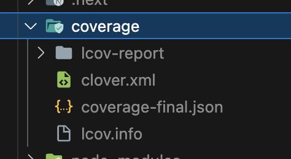

# FETest

> author: @rud1676

- [FrontEnd에게 테스트란?](#fe에서-테스트란)
  - [유닛테스트](#유닛테스트)
  - [통합테스트](#통합테스트)
  - [엔드투엔드 테스트](#엔드투엔드-테스트)
  - [스냅샷 테스트](#스냅샷-테스트)
  - [비주얼 회귀 테스트](#비주얼-회귀-테스트)
- [테스트의 접근방식](#테스트의-접근방식)
  - [지속적 통합](#지속적-통합)
  - [코드 커버리지](#코드-커버리지)
  - [테스트 주도 개발 (Test-Driven Development, TDD)](#테스트-주도-개발-test-driven-development-tdd)

---

> author:rud1676

## FE에서 테스트란?

먼저 FrontEnd의 개발 특성을 이해해야한다.

1. 다양한 사용자의 요구사항을 고려해야한다.
2. 사용자와 인터페이스와 사용자 경험이 다양하다.

따라서 위의 두가지를 검증하기 위해 테스트를 진행한다. 즉,

사용자 경험이나 사용자 요구사항이 "설계대로" 잘 작동하는지 확인하는 것이다. 따라서 테스트를 할때 5가지의 기준으로 생각하며 진행하는 것이 좋다.

1. 품질 보증
2. 사용자 경험 개선
3. 개발 프로세스 최적화
4. 유지보수 용이성
5. 팀 협업 강화

## Nodejs의 테스트 도구들

- Jest: facebook에서 만든 테스트도구 -> zero config를 추구해 별다른 설정 없이 바로 테스트 가능.
- storybook:

## Jest기본 사용법.

1. \_\_test\_\_ 폴더 안에 실행할 테스트 파일을 넣는다.(jest 명령을 치면 모두 실행한다.) or \*.test.js파일을 둔다. 이것또한 모두 실행한다.
2. test함수를 작성한다.

```js
import fn from "./fn"; //test 할 함수를 불러온다.

test("1은 1이야 - 테스트 제목(명확해야한다. 콘솔에서 이부분이 뜬다.)", () => {
  expect(fn(1)).toBe(1);
});

test("1은 2가 아니야 - 테스트 제목(명확해야한다. 콘솔에서 이부분이 뜬다.)", () => {
  expect(fn(1)).not.toBe(1);
});
```

> 테스트 전후에 해줘야될 작업이 있다면..
> beforeEach() => 테스트 전에 실행되는 함수, afterEach()=>테스트 후에 실행되는 함수
> 최초에 한번, 최후에 한번 => beforeAll, afterAll
> 왜쓰는가? => 테스트할 때 디비 연결하고 디비 해제하고 이런걸 하기 위해!

### 유닛테스트

또다른 말로 단위 테스트라고 한다. 소스코드의 '개별단위'를 테스트하여 준비가 되었는지 확인하는 테스트 방법임.

메서드를 테스트하는 메서드다!

이때 **단위테스트를 진행하기 위한 조건**이 있다. 함수(테스트단위)가 아래 조건을 만족해야한다.

1. 독립적이어야한다. - 다른 테스트에 의존적이지 않아야된다.
2. 격리되어야 한다. - Axios등 대상이 의존하는 것을 다른 것으로 대체해야 한다.

> 단위테스트를 왜 사용하는가?
> 서비스가 클수록 로컬에서 내가 짠 코드를 직접 실행시키기 어렵다. (main함수를 임의로 만들고 어쩌구 하는것도 참 어렵다.)
> 또는 디비와 연결된 데이터를 처리하는 로직이라면 그것 또한 실제로 실행시키기가 어렵다.

```js
// addTodo.test.js

describe("addTodo", () => {
  it("adds a new todo to the list", () => {
    const startTodos = [{ text: "Learn React", done: false }];
    const newTodo = { text: "Learn Testing", done: false };
    const expectedTodos = [...startTodos, newTodo];

    const result = addTodo(startTodos, newTodo);

    expect(result).toEqual(expectedTodos);
  });
});
```

### 통합테스트

단위테스트 모두 통과했을 때 이 모듈들을 한꺼번에 실행한다!

1. 모듈들의 상호작용이 잘 이루어지는가?
2. 통합하는 과정에서 오류가 나는가?

를 찾아본다.

투두리스트앱으로 예시를 든다면

1. 사용자가 할 일 입력 필드에 텍스트를 입력
2. 사용자가 할 일을 추가하기 위해 버튼을 클릭
3. 할 일 목록이 새로운 할 일로 업데이트되는지 확인

```js
// TodoApp.test.js

import React from "react";
import { render, fireEvent, screen } from "@testing-library/react";
import TodoApp from "./TodoApp"; // TodoApp 컴포넌트를 가정함

describe("TodoApp Integration Test", () => {
  it("allows a user to add a todo item and displays it in the list", () => {
    // TodoApp 컴포넌트 렌더링
    render(<TodoApp />);

    // 할 일 입력 필드와 추가 버튼 찾기
    const inputField = screen.getByPlaceholderText("Add a new task here...");
    const addButton = screen.getByRole("button", { name: "Add" });

    // 할 일 입력하고 추가 버튼 클릭
    fireEvent.change(inputField, {
      target: { value: "Learn Integration Testing" },
    });
    fireEvent.click(addButton);

    // 할 일 목록에 새로운 할 일이 추가되었는지 확인
    expect(screen.getByText("Learn Integration Testing")).toBeInTheDocument();
  });
});
```

### 엔드투엔드 테스트

어플리케이션을 사용자 관점에서 "전체적"으로 테스트하는 것이 목표이다. 즉, 완성이 되고 전체적으로 테스트한다.

ChatGPT에게 물어보았다.

> 그에 따른 도구는 Node패키지의 Puppeteer는 크롬 브라우저를 제어하는 Node 라이브러리로
> Jest와 함께 사용하여 브라우저에서의 E2E 테스트를 수행할 수 있습니다. 이 방식을 사용하면 Jest의 테스팅 기능과 Puppeteer의 브라우저 제어 기능을 결합하여, 강력한 E2E 테스팅 환경을 구축할 수 있습니다.
> 엔드투엔드 테스트를 위한 툴을 선택할 때는, 프로젝트의 요구사항과 팀의 경험, 기존의 인프라와의 호환성 등을 고려하여 결정하는 것이 중요합니다.

즉, 프론트 개발단에서만 하는게 아닌 서비스를 이루는 전체적인 관점에서 고려하여 EtoE테스트를 진행한다.

```json
//package.json
{
  "scripts": {
    "cypress:open": "cypress open"
  }
}
```

```js
// cypress/integration/todo_app_spec.js

describe("Todo App", () => {
  it("allows me to add todo items", () => {
    // 앱을 방문합니다.
    cy.visit("/");

    // 새로운 할 일을 입력합니다.
    cy.get('[data-testid="todo-input"]').type("Learn Cypress{enter}");

    // 새로운 할 일이 목록에 추가되었는지 확인합니다.
    cy.get('[data-testid="todo-item"]')
      .should("have.length", 1)
      .and("contain", "Learn Cypress");

    // 또 다른 할 일을 추가합니다.
    cy.get('[data-testid="todo-input"]').type("Write E2E tests{enter}");

    // 두 번째 할 일이 목록에 추가되었는지 확인합니다.
    cy.get('[data-testid="todo-item"]')
      .should("have.length", 2)
      .and("contain", "Write E2E tests");
  });
});
```

### 스냅샷 테스트

성공하는 케이스를 "찍어두고!!" 비교합니다.

따라서 성공 실패를 스냅샷과 비교해 다르면 실패, 같으면 성공입니다!

```js
// TodoList.test.js

import React from "react";
import { render } from "@testing-library/react";
import TodoList from "./TodoList";

describe("TodoList", () => {
  it("renders correctly", () => {
    const todos = [
      { id: 1, text: "Learn Jest", completed: false },
      { id: 2, text: "Write Snapshot Tests", completed: false },
    ];

    const { container } = render(<TodoList todos={todos} />);
    expect(container).toMatchSnapshot();
  });
});
```

실제로 생기는 스냅샷 파일

```js
exports[`TodoList renders correctly 1`] = `
<div>
  <ul>
    <li>Learn Jest</li>
    <li>Write Snapshot Tests</li>
  </ul>
</div>
`;
```

### 비주얼 회귀 테스트

> 비주얼 회귀 테스트는 주로 사용자 인터페이스의 시각적 변화를 감지하는 테스트.
> 스토리북 패키지를 통해 보통 이루어진다.

```js
// TodoItem.stories.js

import React from "react";
import { TodoItem } from "./TodoItem";

export default {
  title: "TodoItem",
  component: TodoItem,
};

export const Default = () => <TodoItem text="Learn Storybook" />;
```

## 테스트의 접근방식

테스트를 효과적으로 수행하기 위한 방법들.

(코드를 예시로 듭니다. travel앱으로 한번 예시를 들어보자.)

### 코드 커버리지

> CHATGPT: 코드 커버리지(Code Coverage) 테스트는 테스트 스위트가 소프트웨어의 코드 베이스의 얼마나 많은 부분을 실행(커버)하는지 측정하는 방식입니다.
> 코드 커버리지는 일반적으로 테스트가 얼마나 포괄적인지를 나타내는 지표로 사용되며, 높은 코드 커버리지 수치는 코드의 대부분이 테스트에 의해 검증되었음을 의미합니다.
> 그러나 코드 커버리지가 높다고 해서 반드시 소프트웨어의 품질이 높다는 것을 의미하지는 않습니다. 테스트의 품질, 테스트가 실제로 중요한 시나리오를 커버하는지 여부도 중요합니다.

- 문장 커버리지(Statement Coverage): 테스트 스위트가 코드 베이스의 각 명령문(statement)을 최소 한 번 실행하는지 여부를 측정합니다.
- 분기 커버리지(Branch Coverage): 조건문(예: if, switch)의 모든 결과(true/false)가 테스트에 의해 실행되는지 확인합니다.
- 경로 커버리지(Path Coverage): 코드의 가능한 모든 실행 경로를 테스트하는 것을 목표로 합니다. 분기 커버리지보다 더 포괄적이지만, 실제로는 모든 경로를 테스트하는 것이 실질적으로 어렵거나 불가능할 수 있습니다.
- 함수 커버리지(Function Coverage): 테스트가 코드 베이스의 각 함수/메소드를 최소 한 번 호출하는지 확인합니다.

- 코드 커버리지 도구 선택: 여러 언어와 환경에서 사용할 수 있는 다양한 코드 커버리지 도구가 있습니다 자바스크립트는 제스트가 대표적.
- 테스트 실행 및 커버리지 데이터 수집: 테스트 스위트를 실행하고, 코드 커버리지 도구를 사용하여 실행 중인 코드의 양을 추적합니다.
- 커버리지 보고서 생성: 도구는 커버리지 데이터를 분석하고, 커버리지 보고서를 생성합니다. 이 보고서는 일반적으로 테스트에 의해 커버되지 않은 코드 영역을 강조하여 개발자가 테스트 커버리지를 개선할 수 있도록 도와줍니다.
- 결과 분석 및 테스트 개선: 커버리지 보고서를 분석하여 테스트 스위트의 효율성을 평가하고, 미커버된 영역을 식별하여 테스트를 추가하거나 개선합니다.

```js
"use client";

import { useState } from "react";
import { useQuery } from "@tanstack/react-query";

import ScheduleHeader from "@/app/(main)/schedule/_component/ScheduleHeader";
import Main from "@/app/(main)/schedule/_component/Main";
import TeleModal from "./_component/TeleModal";
import MemoModal from "./_component/MemoModal";

import { makeToday } from "@/util/data";

import { myPlanApi } from "@/api/myplan";

const Schedule = () => {
  const [year, month, day] = makeToday();
  const { data: plan } = useQuery({
    queryKey: ["plan", `${year}-${month + 1}-${day}`],
    queryFn: () => myPlanApi.getDetailListByDay(`${year}-${month + 1}-${day}`),
    enabled: true,
  });
  console.log(plan);
  const [phoneNum, setPhoneNum] = useState(null);
  const [memo, setMemo] = useState("");
  return (
    <>
      <ScheduleHeader
        details={plan}
        year={year}
        month={month + 1}
        day={day}
        title={plan?.title ? plan.title : "세부 일정 없음"}
      />
      <Main
        planid={plan?.id}
        plans={plan?.details ? plan.details : []}
        setPhoneNum={setPhoneNum}
        setMemo={setMemo}
      />
      <TeleModal
        phone={phoneNum}
        open={phoneNum !== null}
        handleClose={() => setPhoneNum(null)}
        onClickConfirm={() => setPhoneNum(null)}
      />
      <MemoModal memo={memo} setMemo={setMemo} />
    </>
  );
};

export default Schedule;
```

이 파일에서는 아래와 같이 테스트를 해볼 수 있다.

1. API 호출이 올바르게 이루어지는지 (useQuery 사용)
2. 상태 관리가 올바르게 작동하는지 (useState 사용)
3. 자식 컴포넌트들이 올바르게 렌더링되고 있는지
4. ScheduleHeader, Main, TeleModal, MemoModal 컴포넌트들과의 상호작용

```js
import { render, screen, waitFor } from "@testing-library/react";
import userEvent from "@testing-library/user-event";
import Schedule from "./Schedule";
import { QueryClient, QueryClientProvider } from "@tanstack/react-query";

jest.mock("@/api/myplan", () => ({
  myPlanApi: {
    getDetailListByDay: jest.fn().mockResolvedValue({
      // API 응답을 모킹합니다.
      id: "1",
      title: "Test Plan",
      details: [
        { id: "detail-1", text: "Detail 1" },
        { id: "detail-2", text: "Detail 2" },
      ],
    }),
  },
}));

describe("Schedule Component", () => {
  const queryClient = new QueryClient();

  beforeEach(() => {
    render(
      <QueryClientProvider client={queryClient}>
        <Schedule />
      </QueryClientProvider>
    );
  });

  it("renders schedule header with plan details", async () => {
    await waitFor(() => {
      expect(screen.getByText("Test Plan")).toBeInTheDocument();
      expect(screen.getByText("세부 일정 없음")).toBeInTheDocument();
    });
  });

  it("renders main component with plan details", async () => {
    await waitFor(() => {
      expect(screen.getByText("Detail 1")).toBeInTheDocument();
      expect(screen.getByText("Detail 2")).toBeInTheDocument();
    });
  });

  // 추가적인 테스트 케이스 작성...
});
```

```json
"scripts": {
  "test": "jest",
  "test:coverage": "jest --coverage"
}
```


실제로 생성되는 파일들에 대한 설명

- coverage/lcov-report/ (HTML 보고서): 코드 커버리지 정보를 시각적으로 표시합니다.
- coverage/clover.xml: xml파일으 ㅣ보고서임
- coverage/coverage-final.json:JSON 형식의 커버리지 보고서
- coverage/lcov.info: lcov.info 형식의 보고서

```xml
<?xml version="1.0" encoding="UTF-8"?>
<coverage generated="1615461910">
  <project timestamp="1615461910" name="All files">
    <file name="Schedule.jsx" path="/path/to/Schedule.jsx">
      <metrics statements="10" coveredstatements="8" ... />
    </file>
    <!-- ... more files ... -->
  </project>
</coverage>
```

```info
TN:
SF:/path/to/Schedule.jsx
FN:1,(anonymous_1)
FN:10,(anonymous_2)
FNDA:1,(anonymous_1)
FNDA:0,(anonymous_2)
FNF:2
FNH:1
DA:1,1
DA:10,0
LF:2
LH:1
BRDA:...
BRH:...
end_of_record
```

읽는 법.

```txt
TN: 테스트 이름 (Test Name). 여기서는 비어 있습니다.
SF: 소스 파일 (Source File). 이것은 커버리지 데이터가 수집된 파일의 경로입니다.
FN: 함수 시작 줄 번호와 함수 이름. 예: FN:1,(anonymous_1)는 1번째 줄에 'anonymous_1'라는 이름의 함수가 시작된다는 것을 의미합니다.
FNDA: 함수가 실행된 횟수 (Function Data). 예: FNDA:1,(anonymous_1)는 'anonymous_1' 함수가 한 번 실행되었다는 것을 의미합니다.
FNF: 분석된 파일에서 발견된 함수의 총 수 (Functions Found).
FNH: 테스트에서 호출된 함수의 수 (Functions Hit). 즉, 실제로 실행된 함수의 수입니다.
DA: 각 줄의 실행 데이터 (Line Data). 예: DA:1,1는 1번째 줄이 한 번 실행되었다는 것을 의미합니다.
LF: 분석된 파일에서 발견된 실행 가능한 코드 라인의 총 수 (Lines Found).
LH: 테스트에서 실행된 코드 라인의 수 (Lines Hit).
BRDA: 각 분기에 대한 데이터. 분기 카운터 ID, 라인 번호, 블록 번호, 분기 번호를 포함합니다.
BRH: 실행된 분기의 수 (Branches Hit).
이 보고서는 기본적으로 다음과 같이 해석됩니다:

Schedule.jsx 파일에는 2개의 함수가 있습니다(FNF:2).
이 중 1개의 함수가 테스트에 의해 호출되었습니다(FNH:1).
파일에는 2개의 실행 가능한 코드 라인이 있습니다(LF:2).
이 중 1개의 라인이 테스트에 의해 실행되었습니다(LH:1).
```

### 지속적 통합

지속적 통합(CI, Continuous Integration)의 테스트 방법론은 소프트웨어 개발 과정에서 통합 단계를 자동화하여, 개발자들이 코드 변경사항을 자주, 그리고 신속하게 통합할 수 있도록 하는 접근 방식. 코드의 품질을 검증하면서 개발 속도를 높여나가는 개념이다.

CI 환경(예: Jenkins, GitLab CI, GitHub Actions 등)에서 테스트를 자동으로 실행하도록 설정하는 것이다.

Git Action의 예시

```yml
name: Node.js CI

on:
  push:
    branches: [main]
  pull_request:
    branches: [main]

jobs:
  build:
    runs-on: ubuntu-latest

    strategy:
      matrix:
        node-version: [14.x, 16.x]

    steps:
      - uses: actions/checkout@v3
      - name: Use Node.js ${{ matrix.node-version }}
        uses: actions/setup-node@v3
        with:
          node-version: ${{ matrix.node-version }}
          cache: "npm"
      - run: npm ci
      - run: npm run build --if-present
      - name: Run Jest
        run: npm test -- --coverage
```

### 테스트 주도 개발 (Test-Driven Development, TDD)

테스트를 먼저 작성하고, 그 테스트를 통과하는 코드를 작성하는 개발 방법론입니다.

코드 커버리지에서 작성햇던 테스트코드를 컴포넌트 작성전에 **먼저** 작성하고...

SChdeul.jsx의 컴포넌트를 그다음에 테스트가 통과하게끔 기본구조를 작성합니다.

그리고나서 테스트를 계속진행하면서 리팩토링을 하는 작업방식입니다.

다시 Todoapp예시를 보자

1. 테스트 케이스를 먼저 작성한다.

```js
import { render, screen, fireEvent } from "@testing-library/react";
import TodoApp from "./TodoApp";

describe("TodoApp", () => {
  test("allows users to add items to their list", () => {
    render(<TodoApp />);

    // 입력 필드와 추가 버튼 찾기
    const inputField = screen.getByPlaceholderText("Add a new task here...");
    const addButton = screen.getByText("Add");

    // 새로운 할 일 입력하고 추가 버튼 클릭
    fireEvent.change(inputField, { target: { value: "Learn TDD" } });
    fireEvent.click(addButton);

    // 새로운 할 일이 목록에 추가되었는지 확인
    expect(screen.getByText("Learn TDD")).toBeInTheDocument();
  });
});
```

2. 테스트 케이스에 맞게 컴포넌트를 코딩한다.

```js
import React, { useState } from "react";

const TodoApp = () => {
  const [todos, setTodos] = useState([]);
  const [task, setTask] = useState("");

  const handleAddTodo = () => {
    if (task) {
      setTodos([...todos, { text: task }]);
      setTask("");
    }
  };

  return (
    <div>
      <input
        type="text"
        placeholder="Add a new task here..."
        value={task}
        onChange={(e) => setTask(e.target.value)}
      />
      <button onClick={handleAddTodo}>Add</button>
      <ul>
        {todos.map((todo, index) => (
          <li key={index}>{todo.text}</li>
        ))}
      </ul>
    </div>
  );
};

export default TodoApp;
```

3. 테스트 후 리팩토링 반복.
