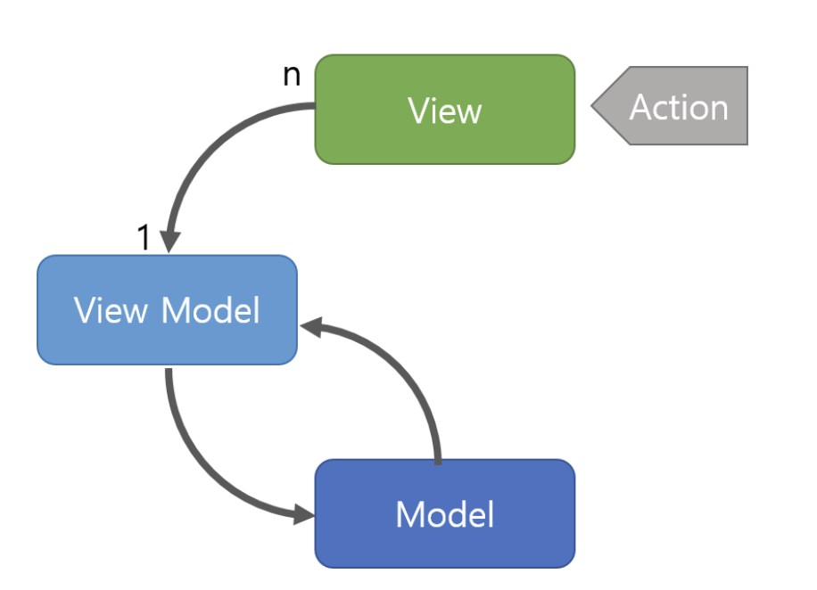

# MVVM vs Flux Pattern

> author: @rud1676

- [1.MVC패턴](#11-mvcmodel-view-contorller)
- [2.MVVM](<#MVVM(Feat-Vue)>)
  - [2-1. MVC vs MVVM](#21-mvc-vs-mvvm)
- [3.Flux](<#Flux(Feat-React)>)
  - [3-1. Flux vs MVC](#21-mvc-vs-mvvm)
- [Flux vs MVVM(feat Vue, React)](#flux-vs-mvvmfeat-vue-react)
- [Vue](#데이터-바인딩-vue---mvvm)
- [React](#컴포넌트-상태-관리-react---flux)

---

(Todolist MVVM, MVC패턴 비교 후)

## 1 MVC(Model-View-Contorller)

Chat GPT에게 MVC패턴이 무엇인지 물어봤다.

### MVC패턴이란.

사용자 인터페이스를 구축하기 위한 아키텍처. 세가지 구성요소로 이루어져있다!

- View: 사용자에게 정보표시
- Model: 데이터와 비즈니스 로직
- Controller: 사용자의 입력을 처리(View로 입력을 받고, Model로 데이터 업데이트 후 다시 View에 반영하는 동작)

### 왜 등장했을까?

초기의 소프트웨어는 UI와 비즈니스로직이 긴밀하게 결합이 되어있어 코드의 복잡성이 증가했고, 새로운 변경사항을 적용하기 어렵만들어 졌다. 따라서 새로운 코드패턴이 필요했고, 3가지의 목표로 MVC패턴을 설계했다.

- 분리와 독립성 : 비즈니스 로직, UI를 분리
- 재사용과 유연성 : 각 구성 요소를 독립적으로 재사용 가능.
- 유지관리 : 구성 요소 분리로 인해 유지 보수가 용이하다.

### MVC패턴으로 구현한 TodoList

```js
// Model
class TodoModel {
  constructor() {
    this.todos = [];
  }

  addTodo(text) {
    this.todos.push({ text, completed: false });
  }

  toggleTodo(index) {
    this.todos[index].completed = !this.todos[index].completed;
  }
}

// View
class TodoView {
  constructor() {
    this.app = document.querySelector("#app");
    this.input = document.querySelector("#todoInput");
    this.addButton = document.querySelector("#addButton");
    this.todoList = document.querySelector("#todoList");
  }

  get _todoText() {
    return this.input.value;
  }

  displayTodos(todos) {
    // Todo 항목을 화면에 표시하는 로직
    while (this.todoList.firstChild) {
      this.todoList.removeChild(this.todoList.firstChild);
    }

    todos.forEach((todo, index) => {
      const li = document.createElement("li");
      li.textContent = todo.text;
      li.addEventListener("click", () => this.toggleTodo(index));
      this.todoList.appendChild(li);
    });
  }

  bindAddTodo(handler) {
    this.addButton.addEventListener("click", () => {
      if (this._todoText) {
        handler(this._todoText);
      }
    });
  }

  bindToggleTodo(handler) {
    this.toggleTodo = handler;
  }
}

// Controller
class TodoController {
  constructor(model, view) {
    this.model = model;
    this.view = view;

    // 초기 Todo 목록 표시
    this.onTodoListChanged(this.model.todos);

    // View에 이벤트 핸들러 연결
    this.view.bindAddTodo(this.handleAddTodo.bind(this));
    this.view.bindToggleTodo(this.handleToggleTodo.bind(this));
  }

  onTodoListChanged(todos) {
    this.view.displayTodos(todos);
  }

  handleAddTodo(todoText) {
    this.model.addTodo(todoText);
    this.onTodoListChanged(this.model.todos);
  }

  handleToggleTodo(index) {
    this.model.toggleTodo(index);
    this.onTodoListChanged(this.model.todos);
  }
}

// 앱 실행
const app = new TodoController(new TodoModel(), new TodoView());
```

즉, Model과 View를 먼저 분리시키고 이것을 연결하는 작업(상호작용)은 Controller에서 진행한다.

## 2. MVVM

MVVM패턴또한 GUI인터페이스를 갖는 앱개발을 위한 아키텍쳐 패턴이다. 마찬가지로 세가지 구성요소로 분리할 수 있다.

- Model
- View
- VIewModel : View와 Model사이에 중제자 역활을 하는구성요소. View에서 발생하는 이벤트를 처리해 Model을 업데이트.

### 등장배경

MVC로도 복잡성과 상호작용의 다양화로 효과적으로 대응하기가 어려워져서 MVVM패턴에 대한 논의가 필요해짐. 아래 3가지 주요 목표를 가지고 설계가 되었다.

- UI와 비즈니스 로직의 분리
- 데이터 바인딩: ViewModel을 통해 데이터 바인딩을 사용하여 Model과 View의 동기화를 자동화한다.
- 재사용성, 테스트 용이성: ViewModel자체가 재사용성이 높고, UI와 분리가되어있어 테스트에 적합하다.

아래는 Todolist를 MVVM패턴으로 작성한 코드이다.

```js
// mvvm.js

// Model
class TodoModel {
  constructor() {
    this.todos = [];
  }

  addTodo(text) {
    this.todos.push({ text, completed: false });
  }

  toggleTodo(index) {
    this.todos[index].completed = !this.todos[index].completed;
  }
}

// ViewModel
class TodoViewModel {
  constructor(model) {
    this.model = model;
    this.addButton = document.getElementById("addButton");
    this.todoInput = document.getElementById("todoInput");
    this.todoList = document.getElementById("todoList");

    this.addButton.addEventListener("click", () => this.addTodo());
    this.todoList.addEventListener("click", (event) => {
      if (event.target.tagName === "LI") {
        this.toggleTodo(event.target.index);
      }
    });

    this.render();
  }

  addTodo() {
    const text = this.todoInput.value;
    if (text) {
      this.model.addTodo(text);
      this.todoInput.value = "";
      this.render();
    }
  }

  toggleTodo(index) {
    this.model.toggleTodo(index);
    this.render();
  }

  render() {
    // 동기화 작업
    this.todoList.innerHTML = "";
    this.model.todos.forEach((todo, index) => {
      const li = document.createElement("li");
      li.textContent = todo.text;
      li.index = index;
      li.classList.toggle("completed", todo.completed);
      this.todoList.appendChild(li);
    });
  }
}

// 앱 실행
const app = new TodoViewModel(new TodoModel());
```

### 2.1. 왜 MVC 에서 MVVM인가?

더욱더 복잡해지고 사용자와 상호작용이 다양해진 앱에서 MVC패턴은 아래와 같은 문제점이 발생할 수 있다.

- 양방향 데이터 흐름과 상호의존성

View에서 이벤트 발생 => Controller 전달 => Model업데이트 => View업데이트 이러한 과정은 상호 의존성을 증가시켜 복잡성을 관리하기가 어렵게 된다.

무엇보다 다수의 View와 Conteroller가 하나의 Model로 연결될 가능성이 있다!

- UI로직과 비즈니스 로직의 분리 미흡.
  Controller는 어쩌면 View와 Model의 상호작용을 하기 때문에, UI로직, 비즈니스 로직분리가 힘들어진다. -> ViewModel의 render함수만 봐도 딱 알 수있다.

- 사용자의 복잡한 상호작용에 대한 요구사항
  복잡한 UI요구사항에 대해서 (특히 이벤트처리) 효과적으로 처리하기 위해 Controller에 크기가 증가하게 될 것이다.

- 여러개의 View가 동일하 Model을 참조하게 되면...
  일관성이 유지가 어렵게 될 수 있다. 데이터의 일관성을 위해 추가적인 함수를 아마 구현이 필요할 것이다.

이러한 문제 덕분에 MVVM, Flux등 다른 아키텍쳐를 채택하여 대응하고 있는데, 특별히 MVVM패턴이 MVC에 비해 가지는 강점은 **캡슐화**와 **데이터바인딩**이다.

- 캡슐화: ViewModel을 통해서 캡슐화된 View를 제공한다(render함수) 이로서 프로그래머는 ViewModel을 통해 Model을 관리하면 알아서 View가 업데이트 되는 것 처럼 느껴지게 만든다!! - UI로직과 비즈니스 로직이 명확히 분리되어 나타나는 효과임!

- 데이터바인딩: UI의 업데이트 로직을 간소화 해 도움을 준다. 반응성이 높은 UI를 구현할 수 있게된다.

## 4. Flux

Flux패턴은 Facebook에서 고안한 아키텍처. 그래서 주로 React와 함께 사용이 된다!

Flux의 핵심은 **단방향 데이터 흐름** 이다! 이 흐름 덕분에 애플리케이션의 구조를 예측가능하고 이해하기 쉽게 된다.

### 주요 구성 요소

- Action: 데이터 변경과 같은 시스템에서 발생하는 이벤트. 액션은 "타입", "페이로드"를 가진다.
- Dispatcher: 액션들이 흐르는 중앙 허브, 액션이 발생-> 디스패처를 통해 스토어에 전달. Dispatcher의 효과는 액션들이 올바른 순서로 처리될 수 있게 관리하는 것.
- Store:애플리케이션 상태와 로직을 담당. 디스패처로 부터 액션을 받아서 상태를 변경 하고 View에 알림. 여러개의 스토어가 존재할 수 있고, 각 스토어는 독립적인 상태와 로직을 관리해야됨!
- View: React의 컴포넌트와 같이 사용자 인터페이스 요소! 화면에 렌더링하고 사용자의 상호작용을 액션으로 변환하여 디스패처에 전달!

```js
// flux.js

// Action Types
// - 액션의 타입을 정의합니다. 이는 애플리케이션에서 수행할 수 있는 작업을 나타냅니다.
const ADD_TODO = "ADD_TODO";
const TOGGLE_TODO = "TOGGLE_TODO";

// Actions
// - 액션 생성자 함수입니다. 각 액션은 특정 타입과 필요한 데이터를 포함합니다.
function addTodoAction(text) {
  return { type: ADD_TODO, text };
}

function toggleTodoAction(index) {
  return { type: TOGGLE_TODO, index };
}

// Dispatcher
// - 모든 액션들을 수신하고 등록된 콜백을 통해 스토어에 전달하는 중앙 허브입니다.
class Dispatcher {
  constructor() {
    this.callbacks = [];
  }

  dispatch(action) {
    this.callbacks.forEach((callback) => callback(action));
  }

  register(callback) {
    this.callbacks.push(callback);
  }
}

const dispatcher = new Dispatcher();

// Store
// - 애플리케이션의 상태(여기서는 할 일 목록)를 관리합니다.
// - Dispatcher로부터 액션을 받아 상태를 업데이트하고, 변경 사항을 뷰에 알립니다.
class TodoStore {
  constructor() {
    this.todos = [];
    this.listeners = [];

    dispatcher.register((action) => {
      switch (action.type) {
        case ADD_TODO:
          this.addTodo(action.text);
          break;
        case TOGGLE_TODO:
          this.toggleTodo(action.index);
          break;
        // ... 기타 액션 핸들러
      }
    });
  }

  addChangeListener(listener) {
    this.listeners.push(listener);
  }

  removeChangeListener(listener) {
    this.listeners = this.listeners.filter((l) => l !== listener);
  }

  emitChange() {
    this.listeners.forEach((listener) => listener());
  }

  addTodo(text) {
    this.todos.push({ text, completed: false });
    this.emitChange();
  }

  toggleTodo(index) {
    this.todos[index].completed = !this.todos[index].completed;
    this.emitChange();
  }

  getTodos() {
    return this.todos;
  }
}

const todoStore = new TodoStore();

// View
// - 사용자 인터페이스와 사용자의 입력을 처리합니다.
// - 버튼 클릭과 목록 아이템 클릭 이벤트를 통해 액션을 디스패치합니다.
document.getElementById("addButton").addEventListener("click", () => {
  const text = document.getElementById("todoInput").value;
  dispatcher.dispatch(addTodoAction(text));
});

// 뷰 렌더링 함수
// - 스토어의 상태에 따라 할 일 목록을 화면에 표시합니다.
function render() {
  const todos = todoStore.getTodos();
  const todoList = document.getElementById("todoList");
  todoList.innerHTML = "";

  todos.forEach((todo, index) => {
    const todoItem = document.createElement("li");
    todoItem.textContent = todo.text;
    todoItem.classList.toggle("completed", todo.completed);
    todoItem.addEventListener("click", () => {
      dispatcher.dispatch(toggleTodoAction(index));
    });
    todoList.appendChild(todoItem);
  });
}

todoStore.addChangeListener(render); // 스토어의 상태 변경 시 뷰를 업데이트합니다.
render(); // 초기 뷰 렌더링
```

### 3.1 Flux vs MVC

Todolist의 코드만 본다면.. .Flux패턴이 확실히 읽기 어려울 수 있다. 그러나 코드를 이해하게 된다면 데이터예측이 가능하고, 중앙화된 상태관리이기 때문에 복잡성을 관리할 수 있다.

MVC는 코드자체는 읽기 쉬워 유연할 수 있겟지만 예측이 안되는 데이터흐름이 나올 수 있다.

## Flux vs MVVM(feat Vue, React)

Flux 패턴의 구조


MVVM 패턴의 구조



Vue,React로 짠 코드 비교

```js
new Vue({
  el: "#app",
  data: {
    newTodo: "",
    todos: [],
  },
  methods: {
    addTodo() {
      if (this.newTodo.trim()) {
        this.todos.push({ text: this.newTodo, completed: false });
        this.newTodo = "";
      }
    },
    toggleTodo(index) {
      this.todos[index].completed = !this.todos[index].completed;
    },
  },
});
```

```js
import React, { useState, useContext } from "react";

const TodoContext = React.createContext();

const TodoProvider = ({ children }) => {
  const [todos, setTodos] = useState([]);

  const addTodo = (text) => {
    setTodos([...todos, { text, completed: false }]);
  };

  const toggleTodo = (index) => {
    const newTodos = [...todos];
    newTodos[index].completed = !newTodos[index].completed;
    setTodos(newTodos);
  };

  return (
    <TodoContext.Provider value={{ todos, addTodo, toggleTodo }}>
      {children}
    </TodoContext.Provider>
  );
};

const App = () => {
  const { todos, addTodo, toggleTodo } = useContext(TodoContext);
  const [newTodo, setNewTodo] = useState("");

  const handleAddTodo = () => {
    addTodo(newTodo);
    setNewTodo("");
  };

  return (
    <div>
      <input
        type="text"
        value={newTodo}
        onChange={(e) => setNewTodo(e.target.value)}
        onKeyUp={(e) => e.key === "Enter" && handleAddTodo()}
      />
      <button onClick={handleAddTodo}>Add</button>
      <ul>
        {todos.map((todo, index) => (
          <li key={index} onClick={() => toggleTodo(index)}>
            {todo.text}
          </li>
        ))}
      </ul>
    </div>
  );
};

const TodoApp = () => (
  <TodoProvider>
    <App />
  </TodoProvider>
);

export default TodoApp;
```

차이점 기술(데이터 흐름 관점)

### 데이터 바인딩 (Vue - MVVM):

Vue는 양방향 데이터 바인딩을 제공 (v-model). ViewModel이 View와 Model 사이의 상태 동기화를 자동으로 관리.
Vue의 템플릿 문법은 선언적이며, HTML에 가깝다

즉
data - v-model
computed - viewmodel

### 컴포넌트 상태 관리 (React - Flux):

- React에서 상태 관리는 일반적으로 단방향 데이터 흐름.
- 상태를 변경하기 위해 useState나 상태 관리 라이브러리를 사용.
- React는 JSX를 사용하여 HTML과 JavaScript를 결합한 선언적 UI를 작성.

---

상대방 질문.

1. flux패턴 => redux ==>
   react와 redux와 패턴이 비슷하니까 redux를 선택하는게.

2. attomic패턴 => recoil ==> react를 만든 페이스북이 recoil을 만들엇는데
   recoil을 쓰는게 더 합리적이냐.

어떤게 더 합리적인가?

---

캡슐화 =>
은닉화 필수적인가? yes or no => 정답
readonly => private #

->

프로젝트 테스트 TDD 방법론.
